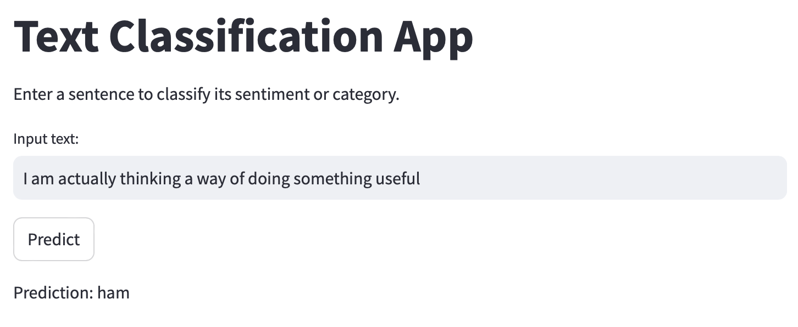
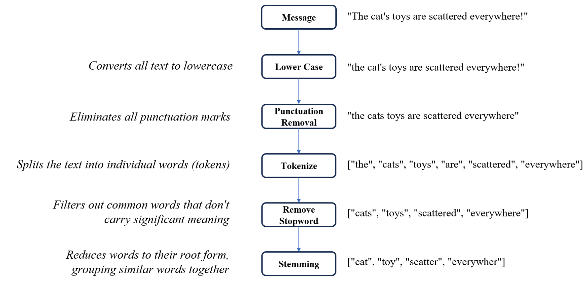
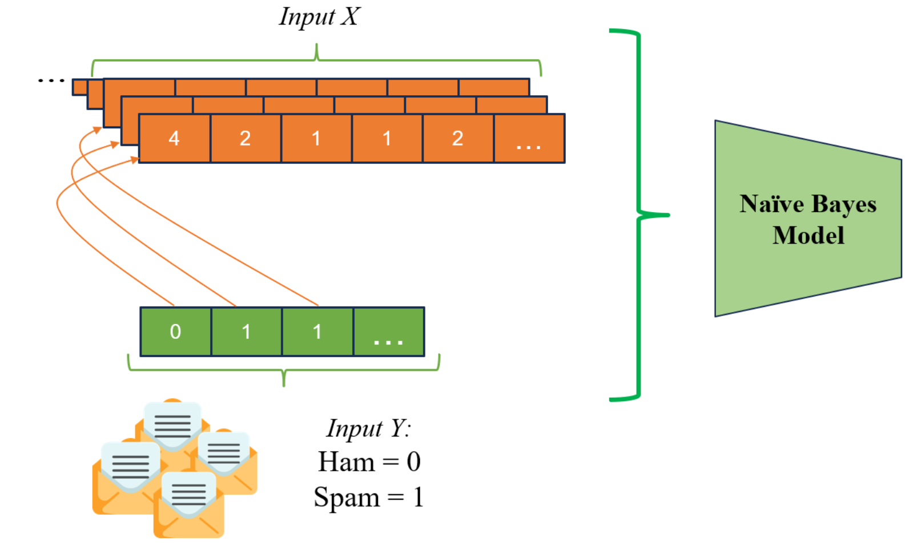

# spam-text-classification
This repository contains a Streamlit application for classifying text based on a pre-trained model. The application allows users to enter text, which is then processed and classified using a machine learning model.

## Features

- Text preprocessing including lowercase conversion, punctuation removal, tokenization, stopwords removal, and stemming.
- Classifies input text using a pre-trained machine learning model.
- User-friendly interface powered by Streamlit.

## Installation

Before you start, ensure you have the following installed:

- Python 3.7 or higher
- Required Python packages listed in `requirements.txt`

You can install the required packages using pip:

```sh
pip install -r requirements.txt
```

## How to run
```sh
streamlit run app_spam_filtering.py
```



## Usage
- Enter the text you want to classify in the provided text input field.
- Click on the "Predict" button to see the classification result.
- The prediction result will be displayed on the page.

## File Structure
- app.py: Main application file containing the Streamlit app code.
- models/: Directory containing the pre-trained model files.
- requirements.txt: List of required Python packages.

## Preprocessing Steps

The application performs the following text preprocessing steps:
- Convert text to lowercase.
- Remove punctuation from the text.
- Tokenize the text into words.
- Remove stopwords from the tokens.
- Apply stemming to the tokens.

## Model Prediction

The prediction is performed using the following process:
- Load the pre-trained model, dictionary, and label encoder.
- Preprocess the input text.
- Convert the preprocessed text into feature vectors.
- Use the model to predict the class of the input text.
- Display the prediction result.